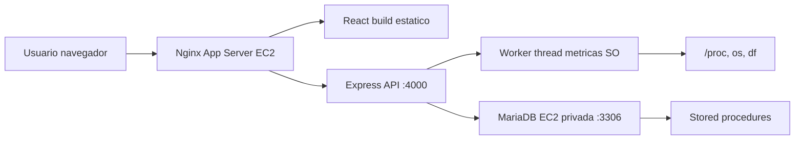

# Informe Tecnico: PC Hardware Hub / FORGE CORE

## 1. Objetivo

Implementar un e-commerce ficticio de productos tecnologicos que funcione sobre infraestructura cloud y evidencie conceptos del curso de Sistemas Operativos: procesos, concurrencia, sincronizacion, seguridad, recursos del sistema y sistemas de archivos.

## 2. Arquitectura

La solucion usa dos servidores EC2. El App Server publica el frontend y API; el Database Server aloja MariaDB. La comunicacion con la base de datos ocurre por IP privada dentro de la VPC.

## 3. Componentes

- Frontend: React, TypeScript, Tailwind CSS y Vite.
- Backend: Node.js, Express, mysql2 y worker threads.
- Base de datos: MariaDB con tablas normalizadas y stored procedures.
- Despliegue: Nginx como reverse proxy, systemd para mantener la API activa.

## 4. Conceptos de Sistemas Operativos

- Procesos e hilos: el backend levanta un worker thread dedicado a recolectar metricas.
- Interaccion con kernel: el worker consulta `/proc`, usa el modulo `os` y ejecuta `df`.
- Sincronizacion: el checkout usa transacciones y `SELECT ... FOR UPDATE` para bloquear stock.
- Memoria y CPU: las metricas guardan uso de CPU, RAM, disco, carga y procesos.
- Seguridad: validacion de payloads, usuario MariaDB con permisos limitados y security groups.

## 5. Flujo principal

1. El usuario entra al e-commerce.
2. Nginx sirve la SPA React.
3. La SPA consulta `/api/products`.
4. El usuario agrega productos al carrito.
5. El checkout llama `/api/orders/simulated-payment`.
6. Express ejecuta `sp_create_simulated_order`.
7. MariaDB valida stock, descuenta inventario y registra movimientos.
8. El panel admin muestra inventario y metricas de sistema.

## 6. Pruebas

- Catalogo responde desde API.
- Detalle de producto retorna por slug.
- Carrito calcula subtotal, IGV y envio.
- Checkout exitoso descuenta stock.
- Checkout con stock insuficiente hace rollback.
- MariaDB solo acepta conexiones desde el App Server.
- Worker registra metricas en `system_metrics`.

## 7. Conclusiones

FORGE CORE cumple la propuesta de e-commerce cloud e incorpora evidencia practica de Sistemas Operativos mediante concurrencia, sincronizacion, monitoreo de recursos y despliegue en Linux.
